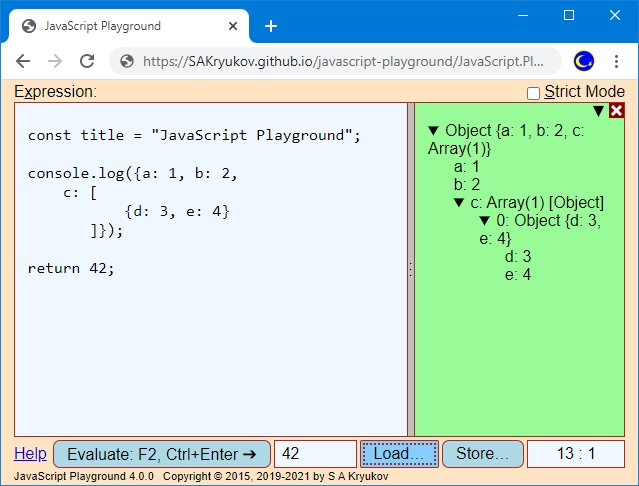

@numbering {
    enable: false
}

{title}JavaScript Playground

[*Sergey A Kryukov*](https://www.SAKryukov.org){.author}

JavaScript Playground, JavaScript calculator, development, and demo tool

*JavaScript Playground can be used as an advanced calculator. The result of the script execution can be viewed immediately; additionally, the console object can be used; structured console results can be browsed as it is done in the JavaScript IDE and debuggers. With playgroundAPI, it can be used as a tool for demonstration and teaching of JavaScript techniques.*

<!-- copy to CodeProject from here ------------------------------------------->

<ul class="download"><li><a href="5291705/Working/JavaScript-Playground.zip">Download source code — 23.4 KB</a></li></ul>



<blockquote id="epigraph" class="FQ"><div class="FQA">Epigraph:</div>
<p><i>It is the child in man that is the source of his uniqueness and creativeness, and the playground is the optimal milieu for the unfolding of his capacities and talents.</i></p>
<dd><a href="https://en.wikipedia.org/wiki/Eric_Hoffer">Eric Hoffer</a></dd>
</blockquote>

## Contents{no-toc}

@toc

## Sentiments

JavaScript Playground is a fork of my very old tool, "JavaScript Calculator". I've used it well before we got node.js and modern in-browser development tools, so I used it a bit for the development, but mostly as a calculator. My main drive was to get rid of any kinds of software calculators mimicking any historical devices, and any kinds of home-baked script parsers. It had to be based on an easy to use well-defined and standard language.

JavaScript Calculator became JavaScript Playground when I started to publish articles with JavaScript code samples and components. I decided that I can turn it into the compact self-containing tool used to demonstrate JavaScript code.

Later I added several useful things, such as file I/O and a fully-fledged console used to browse objects with complex structure.

## JavaScript Playground as a Calculator

### Core

This is the skeleton of the main script explaining core functionality:

```{lang=JavaScript}{id=code-core}
const evaluateWith = (text, writeLine, write, console, isStrict) &gt; {
    return new Function(
        "writeLine", "write", "console", safeInput(text, isStrict))
        (writeLine,   write,   console);

// ...

const console = // ...
сconst writeLine = // ...
const write = // ...

// ...

const evaluate = () &gt; {
    consoleInstance.reset();
    try {
        evaluateResult.value = evaluateWith(
            editor.value,
            (...objects) &gt; consoleInstance.writeLine(objects),
            (...objects) &gt; consoleInstance.write(objects),
            consoleApi,
            strictModeSwitch.checked);
    } catch (exception) {
        consoleInstance.showException(exception);
    } //exception
    return false;
};

// ...

const safeInput = (text, isStrict) &gt; {
    const safeGlobals =
        "const document = null, window = null, navigator = null, " +
        "globalThis = {console: console, write: write, writeLine: writeLine}";
    return isStrict ?
        `"use strict"; ${safeGlobals}\n${text}`
        :
        `${safeGlobals} with (Math) \{\n${text}\n\}`;
};
```

On the very top stack frame of the script, the string with the user JavaScript code is obtained via `editor.value` and passed to `evaluateWith` with three objects used in the context of this code, and the flag, defining if this is a [strict mode](https://developer.mozilla.org/en-US/docs/Web/JavaScript/Reference/Strict_mode) or not.

The context of the code is defined in the function `saveInput`. It blocks access to the important global objects of the Web page environment: `document`, `window`, `navigator`, and, [`globalThis`](https://developer.mozilla.org/en-US/docs/Web/JavaScript/Reference/Global_Objects/globalThis). Three objects are made accessible through `globalThis`: `console`, `write`, and `writeLine`. These objects are implemented and passed to the user script via `evaluate` and then `evaluateWith`. Note passing the names of these objects as `new Function` arguments. The constructor returns a function object, which is called with the actual three objects.

The result of the function call is returned and its value used to populate the control below the editor control `evaluateResult`;

The functions `write` and `writeLine` are implemented via `console`. The number of arguments they support is arbitrary. This is implemented using the [spread syntax](https://developer.mozilla.org/en-US/docs/Web/JavaScript/Reference/Operators/Spread_syntax).

The object `console` re-implements the standard [JavaScript `console` object](https://developer.mozilla.org/en-US/docs/Web/API/console).

### Console

When an appropriate `console` method is called for the first time, a console element is created on the right of the editor control, taking some of its horizontal space of the window. The objects passed to this `console` method are visualized in the console. If the objects are structured, the appropriate tree structure is created. The nodes of the tree are created on the fly. It resolves the problem of circular references in the object.

Implemented `console` methods are [console.assert](https://developer.mozilla.org/en-US/docs/Web/API/console/assert), [console.clear](https://developer.mozilla.org/en-US/docs/Web/API/Console/clear), [console.count](https://developer.mozilla.org/en-US/docs/Web/API/Console/count), [console.debug](https://developer.mozilla.org/en-US/docs/Web/API/Console/count), [console.dir](https://developer.mozilla.org/en-US/docs/Web/API/Console/dir), [console.error](https://developer.mozilla.org/en-US/docs/Web/API/Console/error), [console.info](https://developer.mozilla.org/en-US/docs/Web/API/Console/info), [console.log](https://developer.mozilla.org/en-US/docs/Web/API/Console/log), [console.time](https://developer.mozilla.org/en-US/docs/Web/API/Console/time), [console.timeEnd](https://developer.mozilla.org/en-US/docs/Web/API/Console/time), [console.timeLog](https://developer.mozilla.org/en-US/docs/Web/API/Console/timeLog), [console.warn](https://developer.mozilla.org/en-US/docs/Web/API/Console/warn).

The only difference between [console.debug](https://developer.mozilla.org/en-US/docs/Web/API/Console/count), [console.dir](https://developer.mozilla.org/en-US/docs/Web/API/Console/dir), [console.error](https://developer.mozilla.org/en-US/docs/Web/API/Console/error), [console.info](https://developer.mozilla.org/en-US/docs/Web/API/Console/info), [console.log](https://developer.mozilla.org/en-US/docs/Web/API/Console/log), and [console.warn](https://developer.mozilla.org/en-US/docs/Web/API/Console/warn) is the CSS style of a console message. For the objects derived from `Object`, these methods show interactive content in the console, representing a hierarchy of the object structure in the form of a tree. The nested levels of the hierarchy are shown when a tree node is open and removed when it is closed. This way, circular references in objects are allowed and represented safely. The second form of these functions, with the first argument representing a format string with substitution represented by the rest of the arguments, is not implemented, as it makes little sense. Instead, using [template literals](https://developer.mozilla.org/en-US/docs/Web/JavaScript/Reference/template_literals), introduced by [ECMAScript 2015](https://en.wikipedia.org/wiki/ECMAScript#6th_Edition_-_ECMAScript_2015), is recommended.

The method [`console.assert(assertion, ...objects)`](https://developer.mozilla.org/en-US/docs/Web/API/Console/assert) also behaves like [console.log](https://developer.mozilla.org/en-US/docs/Web/API/Console/log) and other similar methods, with the following exception: the first argument is boolean, reserved for the assert condition. If the first argument `assertion` evaluates to `true`, nothing happens, otherwise, the assertion failure message is displayed, followed by the rest of the arguments `...objects`.

<uNote</u>:<br/>
In some browsers, the timing methods [console.time](https://developer.mozilla.org/en-US/docs/Web/API/Console/time), [console.timeEnd](https://developer.mozilla.org/en-US/docs/Web/API/Console/timeEnd), [console.timeLog](https://developer.mozilla.org/en-US/docs/Web/API/Console/timeLog) may present accuracy problems. The time reading can be rounded or slightly randomized by a particular browser. At the moment of writing, correct timing was observed in Blink+V8-based browsers, such as Chromium, Chrome, Opera, and Vivaldi. Rounding was observed in the browsers using [SpiderMonkey](https://en.wikipedia.org/wiki/SpiderMonkey). For further information, please see [this documentation page](https://developer.mozilla.org/en-US/docs/Web/API/Performance/now).

For the console implementation, see the function object `consoleInstance.showException(exception)` in the source code.

### File I/O

File I/O is the newest feature. It is not very usual for a Web page, but there is nothing too difficult in it. File I/O is used in three points: 1) a JavaScript text can be loaden into the editor control, 2) the content of the editor control can be saved in a file, 3) the content of the console can be converted to text (possibly with some loss of information) and saved in a text file. This is the implementation:

```{lang=JavaScript}{id=code-fileIO}
const fileIO = {

    storeFile: (fileName, content) &gt; {
        const link = document.createElement('a');
        link.href = `data:text/plain;charset=utf-8,${content}`; //sic!
        link.download = fileName;
        link.click();
    },
    
    // loadTextFile arguments:
    // fileHandler(fileName, text),
    // acceptFileTypes: comma-separated, in the form: ".js,.json"
    loadTextFile: (fileHandler, acceptFileTypes) &gt; { 
        const input = document.createElement("input");
        input.type = "file";
        input.accept = acceptFileTypes;
        input.value = null;
        if (fileHandler)
            input.onchange = event &gt; {
                const file = event.target.files[0];
                if (!file) return;
                const reader = new FileReader();
                reader.readAsText(file);
                reader.onload = readEvent &gt;
                    fileHandler(file.name, readEvent.target.result);
            }; //input.onchange
        input.click();
    },

};
```

Note that the modern [File System Access API](https://developer.mozilla.org/en-US/docs/Web/API/File_System_Access_API) is not used here, even though it was used in the prototype project. The implementation based on the temporarily created elements and `click` call is simpler and sufficient for the purpose.

### Exception Handling

In the code of [`evaluate`](#code-core), all exceptions are caught and handled by `consoleInstance.showException(exception)`. If an exception is caught, the element corresponding to `consoleInstance` is shown with the yellow background and the exception information. At this point, there can be two cases: some browsers will locate the line and the column in the input script, the point where the error is detected, and report it. In some other browsers, this information is considered unsafe and is not available.

If this information is available, the text caret is also put in the reported position in the `edit` control. This is the skeleton of the `consoleInstance` member functions setting the caret and showing exception information:

```{lang=JavaScript}{id=code-set-caret}
const consoleInstance = {

    // ...

    setCaret: (line, column) =&gt; {
        const lines = editor.value.split(definitionSet.textFeatures.newLine);
        let position = 0;
        for (let index = 0; index < line && index < lines.length; ++index)
            position += lines[index].length + 1;
        editor.setSelectionRange(position + column - 1, position + column);
    },

    showException: function (exceptionInstance) {
        // ...
        this.writeLine(/* exceptionInstance.name, message, formatting... */);
        const knownPosition = isKnown(exceptionInstance.lineNumber)
            && isKnown(exceptionInstance.columnNumber);
        if (knownPosition) {
            this.writeLine(
                [`Line: ${exceptionInstance.lineNumber - 2},` +
                 ` column: ${exceptionInstance.columnNumber + 1}`]);
            this.setCaret(
                exceptionInstance.lineNumber - 3,
                exceptionInstance.columnNumber + 1);
        }
    },

    // ...

};
```

Offsets in line and column numbers are explained by the fact, that not all script code is shown in the `edit` control. Some code is not visible, added by [`safeInput`](#code-core).

### Handling Lexical Errors

It's very typical that the script does not execute in the browser at all, silently, even if you use `try` to catch all exceptions. It happens when some errors are of the lexical level.

When you write regular JavaScript code without `new Function`, you cannot catch some errors on the lexical level.

You can catch:
```{lang=JavaScript}{id=code-runtime-exception-capture}
try {
    const x = 3;
    x = x/y;
} catch (e) {
    alert(e); // Reference error: y is not defined
}
```

but it would not work with
```{lang=JavaScript}{id=code-lexical-error-capture}
try {
    const a = [1, 2, 3;] // ';' is the lexical-level bug
} catch (e) { // won't be caught! 
    alert(e);
}
```

However, if you enter the second code fragment in the `editor` element, text area, pass its value to `evaluate`, and sandwich it a try-catch block, the lexical-level problem will be processed as an exception!

The [code sample shown above](#code-lexical-error-capture) will show the alert `"SyntaxError: missing ] after element list"`.

You can consider this as a method of "converting all errors into exceptions". All errors will be covered by common [exception handling](#heading-excepton-handling).

## Playground API

The idea behind `playgroundAPI` is to pass some script to the main JavaScript Playground application "index.html", populate the value of the `editor` control with the script text, and optionally execute it in the main application, optionally in strict mode. In this kind of usage, let's consider the main JavaScript Playground application as a "host", used by the "client" part written by the user.

This way, the user can run the client script in the context service application and do everything the application can do [as a calculator](#heading-javascript-playground-as-a-calculator). It can be done for the demonstration of the JavaScript code and technique, life demo illustrating publications, and so on. To see how it may look, please try out the [Playground API Demo](https://SAKryukov.github.io/javascript-playground/demo.playgroundAPI).

The user of `playgroundAPI` supplies the client script and instructs the host to populate `edit` control with the script text and define what to do with it. Naturally, it should be done in a very simple way. Let's look at a simple code sample.

### Usage

This is the simplest example of the client code using `playgroundAPI`:

```{lang=HTML}{id=code-playgroundAPI-sample}
&lt;!DOCTYPE html&gt;
&lt;script src="../JavaScript.Playground/playgroundAPI.js"&gt;
&lt;/script&gt;
&lt;script&gt;

return "Write some code and press Ctrl+Enter"

&lt;/script&gt;
&lt;script&gt;showSample("Just Calculator");&lt;/script&gt;
```

The host populates the `editor` control with the script text shown in the second `scrip` element and sets the Web page title to "Just Calculator". By default, the host should execute the code and use non-strict mode. To change this behavior, the script should call `showSample` with one or two additional Boolean arguments. This call redirects to the how Web page, the host application, which does the rest.

### Implementation

The core implementation object `JavaScriptPlaygroundAPI` implements functionality for both client and host parts. It also explains the idea:

```{lang=JavaScript}{id=code-playground-api}
const JavaScriptPlaygroundAPI = {
   APIDataKey: "S. A. Kryukov JavaScript Playground API",
   storage: sessionStorage,
   userCall: function (path, code, title, doNotEvaluate, strict) {
      this.storage.setItem(this.APIDataKey,
        JSON.stringify({
            code: code,
            doNotEvaluate: doNotEvaluate,
            strict: strict,
            title: title }));
      document.location = path;
   },
   // host's internal:
   reload: function (code, isStrict) {
      this.storage.setItem(this.APIDataKey,
        JSON.stringify({
            code: editor.value,
            doNotEvaluate: true,
            strict: isStrict }));
      window.location.reload(false);
   },
   onLoad: function (handler) {
      const item = this.storage.getItem(this.APIDataKey);
      this.storage.removeItem(this.APIDataKey);
      if (!item) return;
      const script = JSON.parse(item);
      if (!script) return;
      if (handler)
         handler(script.title,
            script.code,
            script.doNotEvaluate,
            script.strict);
   },
}; //JavaScriptPlaygroundAPI
```

The method `userCall` provides the basic functionality of the client part. It initializes the operation. The function `showSample` should calculate the URL for the host Web page, the content of the second `script` element containing the text of the user script, define the options, and pass this data to `userCall`. This data is stored in the [`sessionStorage`](https://developer.mozilla.org/en-US/docs/Web/API/Window/sessionStorage) in the form of [`JSON`](https://developer.mozilla.org/en-US/docs/Web/JavaScript/Reference/Global_Objects/JSON).

To see how the data is collected from the user-supplied HTML by `showSample`, see its implementation in `playgroundAPI.js`.

After the user HTML to the host Web page, it is loaded and calls `JavaScriptPlaygroundAPI.onLoad`. If the content of `sessionStorage` is found by the key `APIDataKey` and evaluates to `true`, and the script text is not empty, `JavaScriptPlaygroundAPI.onLoad` calls the `handler` supplied by the host JavaScript Playground application. Depending on the options passed via JSON content, the host changes the page title, populates the `editor` element, optionally switched to the strict or non-strict mode, and optionally executes the user script code.

The method `reload` is needed when the user changes the state of the "Strict Mode" control on the host Web page.

To find out the detail of the implementation of the host Web page behavior, please the fragments of the code by `JavaScriptPlaygroundAPI.` in "index.js".

### Limitations

Not all browsers can use `sessionStorage` after the relocation. It works with the modern browsers based on the [Blink](https://en.wikipedia.org/wiki/Blink_(browser_engine))+[V8](https://en.wikipedia.org/wiki/V8_(JavaScript_engine)) engines, but it could be a problem with some other browsers. In particular, Mozilla can do it only if the host application and the user HTML are located in the same directories.

To handle such situations, I decided to test some JavaScript features, to detect the browsers potentially not capable of supporting the use of `playgroundAPI` as it is presented in the [demo code](https://SAKryukov.github.io/javascript-playground/demo.playgroundAPI). At the time being, it can be detected by the support of the [private class fields](https://developer.mozilla.org/en-US/docs/Web/JavaScript/Reference/Classes/Private_class_fields):

```{lang=JavaScript}{id=code-good-engine}
const goodJavaScriptEngine = (() =&gt; {
    try {
        const advanced = !!Function("class a{ #b; }");
        return advanced;
    } catch {
        return false;
    }
})();
```

This solution is not perfect. What's going to happen if some JavaScript engine like [SpiderMonkey](https://en.wikipedia.org/wiki/SpiderMonkey) is upgraded with the support of the private class fields? Well, if the peculiarity with the Web page locations related to `sessionStorage` remains the same, something like [Firefox](https://en.wikipedia.org/wiki/Firefox) will be able to use `playgroundAPI` and load the host JavaScript Playground Web page, but won't populate the element `editor` with the script text.

Well, at least I warned and suggest what can be used in my error message. In the hide-and-seek game, the person who is "it" should call at the end of the time dedicated for hiding, before opening the eyes: "Ready or not, here I come!". In its Russian form, the call is "If somebody is not yet hidden, this isn't my fault". Same thing here. :-)

## Live Demo

[JavaScript Playground application](https://SAKryukov.github.io/javascript-playground/JavaScript.Playground)

[Playground API Demo](https://SAKryukov.github.io/javascript-playground/demo.playgroundAPI)