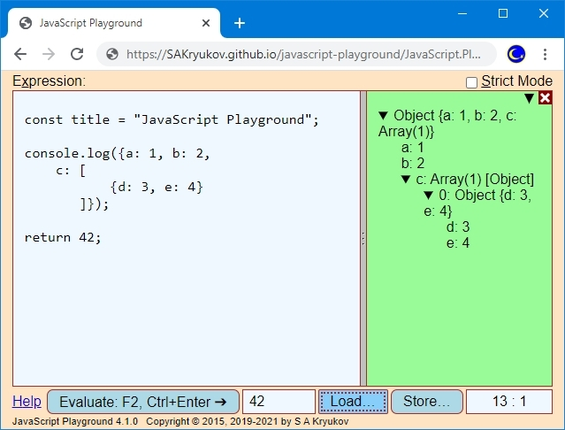

@numbering {
    enable: false
}

{title}JavaScript Playground

[*Sergey A Kryukov*](https://www.SAKryukov.org){.author}

A cross-platform replacement for all those office presentation applications in a single file

**

<!-- copy to CodeProject from here ------------------------------------------->

<ul class="download">
	<li><a href="Web-presentation.zip">Download source code file and demo &mdash; 11.2 MB</a></li>
	<li><a href="https://SAKryukov.github.io/web-presentation/demo">Live demo</a></li>
</ul>



<blockquote id="epigraph" class="FQ"><div class="FQA">Epigraph:</div>
<p><i>It is the child in man that is the source of his uniqueness and creativeness, and the playground is the optimal milieu for the unfolding of his capacities and talents.</i></p>
<dd><a href="https://en.wikipedia.org/wiki/Eric_Hoffer">Eric Hoffer</a></dd>
</blockquote>

## Contents{no-toc}

@toc

## Sentiments

JavaScript Playground is a fork of my very old tool, "JavaScript Calculator". I've used it well before we got node.js and modern in-browser development tools, so I used it a bit for the development, but mostly as a calculator. My main drive was to get rid of any kinds of software calculators mimicking any historical devices, and any kinds of home-baked script parsers. It had to be based on a easy to use but well-defined and standard language.

JavaScript Calculator became JavaScript Playground when I started to publish articles with JavaScript code samples and components. I decided that I can turn it into the compact self-containing tool used to demonstrate JavaScript code.

Later I added several useful things, such as file I/O and fully-fledged console used to browse objects with complex structure.

## JavaScript Playground as a Calculator

### Core

This is the skeleton of the main script explaining core functionality:

```{lang=JavaScript}
const evaluateWith = (text, writeLine, write, console, isStrict) => {
    return new Function(
        "writeLine", "write", "console", safeInput(text, isStrict))
        (writeLine,   write,   console);

// ...

const console = // ...
const writeLine = // ...
const write = // ...

// ...

const evaluate = () => {
    consoleInstance.reset();
    try {
        evaluateResult.value = evaluateWith(
            editor.value,
            (...objects) => consoleInstance.writeLine(objects),
            (...objects) => consoleInstance.write(objects),
            consoleApi,
            strictModeSwitch.checked);
    } catch (exception) {
        consoleInstance.showException(exception);
    } //exception
    return false;
};

// ...

const safeInput = (text, isStrict) => {
    const safeGlobals =
        "const document = null, window = null, navigator = null, " +
        "globalThis = {console: console, write: write, writeLine: writeLine}";
    return isStrict ?
        `"use strict"; ${safeGlobals}\n${text}`
        :
        `${safeGlobals} with (Math) \{\n${text}\n\}`;
};
```

On the very top stack frame of the script, the string with the user JavaScript code is obtained via `editor.value` and passed to `evaluateWith` with three objects used in the context of this code, and the flag, defining if this is a [strict mode](https://developer.mozilla.org/en-US/docs/Web/JavaScript/Reference/Strict_mode) or not.

The context of the code is defined in the function `saveInput`. It block the access to the important global objects of the Web page environment: `document`, `window`, `navigator`, and, [`globalThis`](https://developer.mozilla.org/en-US/docs/Web/JavaScript/Reference/Global_Objects/globalThis). Three objects are made accessible through `globalThis`: `console`, `write` and `writeLine`. These objects are implemented and passed to the user script via `evaluate` and then `evaluateWith`. Note passing the names of these objects as `new Function` arguments. The constructor returns a function object, which is called with the actual three objects.

The result of the function call is returned and its value used to populate the contol below the editor control `evaluateResult`;

The function `write` and `writeLine` are implemented via `console`. They have arbitrary number of arguments. This is implemented using [spread syntax](https://developer.mozilla.org/en-US/docs/Web/JavaScript/Reference/Operators/Spread_syntax).

The object `console` re-implements standard [JavaScript `console` object](https://developer.mozilla.org/en-US/docs/Web/API/console).

### Console

When an appropriate `console` method is called for the first time, a console element is created on the right of the editor control, taking some of its horisontal space of the window. The objects passed to this `console` method are visualized in the console. If the objects are structured, the appropriate tree structure is created. The nodes of the tree are created on the fly. It resolves the problem of circular references in the object.

Implemented `console` methods are [console.assert](https://developer.mozilla.org/en-US/docs/Web/API/console/assert), [console.clear](https://developer.mozilla.org/en-US/docs/Web/API/Console/clear), [console.count](https://developer.mozilla.org/en-US/docs/Web/API/Console/count), [console.debug](https://developer.mozilla.org/en-US/docs/Web/API/Console/count), [console.dir](https://developer.mozilla.org/en-US/docs/Web/API/Console/dir), [console.error](https://developer.mozilla.org/en-US/docs/Web/API/Console/error), [console.info](https://developer.mozilla.org/en-US/docs/Web/API/Console/info), [console.log](https://developer.mozilla.org/en-US/docs/Web/API/Console/log), [console.time](https://developer.mozilla.org/en-US/docs/Web/API/Console/time), [console.timeEnd](https://developer.mozilla.org/en-US/docs/Web/API/Console/time), [console.timeLog](https://developer.mozilla.org/en-US/docs/Web/API/Console/timeLog), [console.warn](https://developer.mozilla.org/en-US/docs/Web/API/Console/warn).

The only difference between [console.debug](https://developer.mozilla.org/en-US/docs/Web/API/Console/count), [console.dir](https://developer.mozilla.org/en-US/docs/Web/API/Console/dir), [console.error](https://developer.mozilla.org/en-US/docs/Web/API/Console/error), [console.info](https://developer.mozilla.org/en-US/docs/Web/API/Console/info), [console.log](https://developer.mozilla.org/en-US/docs/Web/API/Console/log) and [console.warn](https://developer.mozilla.org/en-US/docs/Web/API/Console/warn) is the CSS style of a console message. For the objects derived from `Object`, these methods show interactive content in the console, representing hierarchy of the object structure in the form of a tree. The nested levels of the hierarchy are shown when a tree node is open, and removed when it is closed. This way, circular references in objects are allowed and represented safely. The second form of these functions, with first argument representing a format string with substitution represented by the rest of arguments, is not implemented, as it makes little sense. Instead, using [template literals](https://developer.mozilla.org/en-US/docs/Web/JavaScript/Reference/template_literals), introduced by [ECMAScript 2015](https://en.wikipedia.org/wiki/ECMAScript#6th_Edition_-_ECMAScript_2015), is recommended.

The method [`console.assert(assertion, ...objects)`](https://developer.mozilla.org/en-US/docs/Web/API/Console/assert) also behaves like [console.log](https://developer.mozilla.org/en-US/docs/Web/API/Console/log) and other similar methods, with the following exception: the first argument is boolean, reserved for the assert condition. If the first argument `assertion` evaluates to `true`, nothing happens, otherwise assertion failed message is dispayed, followed by the rest of arguments `...objects`.

<uNote</u>:<br/>
In some browsers, the timing methods [console.time](https://developer.mozilla.org/en-US/docs/Web/API/Console/time), [console.timeEnd](https://developer.mozilla.org/en-US/docs/Web/API/Console/timeEnd), [console.timeLog](https://developer.mozilla.org/en-US/docs/Web/API/Console/timeLog) may present accuracy problems. The time reading can be rounded or slightly randomized by a particular browser. At the moment of writing, correct timing was observed in Blink+V8-based browsers, such as Chromium, Chrome, Opera and Vivaldi. Rounding was observed in the browsers using [SpiderMonkey](https://en.wikipedia.org/wiki/SpiderMonkey). For further information, please see [this documentation page](https://developer.mozilla.org/en-US/docs/Web/API/Performance/now).

### File I/O

File I/O is the newest feature. It is not very usual for a Web page, but there is nothing too difficult in it. File I/O is used in three points: 1) a JavaScript text can be loaden into the editor control, 2) the content of the editor control can be saved in a file, 3) the content of the console can be converted to text (possibly with some loss of information) and saved in a text file. This is the implementation:

```{lang=JavaScript}
const fileIO = {

    storeFile: (fileName, content) => {
        const link = document.createElement('a');
        link.href = `data:text/plain;charset=utf-8,${content}`; //sic!
        link.download = fileName;
        link.click();
    },
    
    // loadTextFile arguments:
    // fileHandler(fileName, text),
    // acceptFileTypes: comma-separated, in the form: ".js,.json"
    loadTextFile: (fileHandler, acceptFileTypes) => { 
        const input = document.createElement("input");
        input.type = "file";
        input.accept = acceptFileTypes;
        input.value = null;
        if (fileHandler)
            input.onchange = event => {
                const file = event.target.files[0];
                if (!file) return;
                const reader = new FileReader();
                reader.readAsText(file);
                reader.onload = readEvent =>
                    fileHandler(file.name, readEvent.target.result);
            }; //input.onchange
        input.click();
    },

};
```

Note that the modern [File System Access API](https://developer.mozilla.org/en-US/docs/Web/API/File_System_Access_API) is not used here, even though it was used in the prototype project. The implementation based on the temporarily created elements and `click` call is simpler and sufficient for the purpose.

### Excepton Handling


## Playground API

```{lang=JavaScript}
}
```

